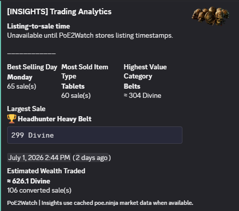

<p align="center">
  
</p>

<h1 align="center">PoE2Watch</h1>

<p align="center">
  <strong>Never wonder if your trade sold again.</strong>
</p>

<p align="center">
  A Discord companion for Path of Exile 2 traders.
</p>

<p align="center">
  
  
  
  
</p>

---

## What Is PoE2Watch?

PoE2Watch is an open-source Discord companion for Path of Exile 2.

It watches your completed sale history, sends Discord notifications when items sell, stores your local trade history in SQLite, and turns your sales into useful analytics.

Built by traders, for traders.

---

## Highlights

| Feature | Status | What It Does |
| --- | --- | --- |
| Instant sale notifications | Complete | Sends a Discord notification when PoE2Watch detects a new completed sale. |
| SQLite trade history | Complete | Stores sales locally for summaries and analytics. |
| Adaptive polling | Complete | Checks faster after recent sales and slows down when idle. |
| Slash commands | Complete | Query stats, recent sales, insights, settings, and top sales from Discord. |
| Hover-style item cards | Alpha | Stores GGG item payloads and shows rarity, item details, and modifiers in sale embeds. |
| poe.ninja estimates | Alpha | Uses cached third-party market data for temporary value estimates. |
| Official GGG OAuth | Placeholder | Waiting on confirmed app registration and official guidance. |
| Static website | Complete | Dark-fantasy landing page ready for Cloudflare Pages. |

---

## Discord Commands

### Trading

| Command | Purpose |
| --- | --- |
| `/last3` | Show your three most recent sales as separate item-style embeds. |
| `/today` | Show today's sales summary. |
| `/week` | Show the last seven days of sales. |
| `/month` | Show the last thirty days of sales. |
| `/league` | Show full-league sales, league age, sales today, highest day, and average per day. |
| `/top` | Show up to three highest-value sales as separate item-style embeds. |

### Analytics

| Command | Purpose |
| --- | --- |
| `/stats` | Show all-time totals, averages, largest sale, and currency breakdowns. |
| `/insights` | Show best selling day, most sold item type, highest value category, largest sale, and estimated wealth traded. |

### Configuration and Dev Tools

| Command | Purpose |
| --- | --- |
| `/settings view` | View current display and estimate settings. |
| `/settings display` | Choose original, Chaos, Exalted, Divine, or all display values. |
| `/settings refresh-rates` | Refresh cached third-party estimate rates. |
| `/dev fake-sale` | Admin/dev-only test notification. Does not save fake sales. |
| `/dev refresh-sale-metadata` | Admin/dev-only backfill for item icons, rarity, and hover-style item details. |

---

## Example Output

### Sale Notification

Discord sale notifications show the item sold, price, league, timestamp, and item artwork when available.

<p>
  
</p>

### Trading Insights

Analytics commands summarize your trading history with best day, most sold item type, highest value category, largest sale, and estimated wealth traded.

<p>
  
</p>

---

## Setup

1. Install dependencies:

```bash
npm install
```

2. Copy the environment template:

```bash
copy .env.example .env
```

3. Fill in your Discord and Path of Exile values:

```env
DISCORD_WEBHOOK_URL=
DISCORD_BOT_TOKEN=
DISCORD_CLIENT_ID=
DISCORD_GUILD_ID=

POE_COOKIE=
POE_LEAGUE=Runes of Aldur
```

4. Register Discord slash commands:

```bash
npm run register
```

5. Start PoE2Watch:

```bash
npm run dev
```

---

## Currency Estimates

PoE2Watch can use cached poe.ninja market data for temporary third-party value estimates.

```env
POE_RATE_PROVIDER=poe-ninja
POE_NINJA_LEAGUE_NAME=Runes of Aldur
POE_NINJA_LEAGUE_SLUG=runesofaldur
```

Important notes:

- poe.ninja estimates are third-party market estimates, not official GGG data.
- Official GGG currency exchange integration remains a placeholder until app registration is confirmed.
- Converted values are marked as estimates.

---

## Developer Testing

Admin/dev-only notification testing is available through:

```text
/dev fake-sale
```

Optional allowlist:

```env
DISCORD_DEV_USER_IDS=your_discord_user_id
```

Fake sale notifications are clearly labeled and are not written to the sales database.

---

## Roadmap

| Version | Focus | Status |
| --- | --- | --- |
| v0.4.x | Statistics, Adaptive Polling, Insights, Settings, Top Sales | Complete |
| v0.5.x | Trading Experience: Hover-style Item Cards, Better Embeds, Inventory, Goals, Autocomplete, Pagination, Statistics Export, `/wealth` | Active |
| v0.6.x | Multi User: PostgreSQL, Multiple Guilds, User Accounts, Inviteable Bot | Planned |
| v0.7.x | Website: Login, Dashboard, Public Stats, API | Planned |
| v1.0.0 | Cloud: Hosted PoE2Watch, OAuth, Managed Bot | Planned |

### Planned `/wealth` Command

```text
Current League Wealth

Current League
approx. 626 Divine

Past 24 Hours
+44 Divine

Past Week
+187 Divine

Best Day
299 Divine
July 1

Goal
Mageblood
████████░░ 82%
```

---

## Architecture Direction

As PoE2Watch grows, the next cleanup target is central configuration.

Planned structure:

```text
src/config/config.ts
```

The goal is to stop reading `process.env` directly throughout services and instead import a typed `config` object with sections for Discord, polling, exchange rates, OAuth placeholders, website links, and database settings.

The statistics layer will also split naturally as analytics grows:

```text
src/services/statistics/summary.ts
src/services/statistics/leaderboards.ts
src/services/statistics/insights.ts
src/services/statistics/charts.ts
src/services/statistics/formatter.ts
```

---

## Project Principles

PoE2Watch is designed to be:

- Read-only
- Self-hosted first
- Community driven
- Open source
- Respectful of Grinding Gear Games' policies
- Built by players, for players

PoE2Watch never automates gameplay, never controls the game client, and never performs trades.

---

## Website

The static website lives in:

```text
website/index.html
```

It is designed to deploy directly from the `website` folder on Cloudflare Pages.

---

## Release Notes

See [CHANGELOG.md](CHANGELOG.md) for release notes, including `v0.5.0-alpha`.

---

## Disclaimer

PoE2Watch is an independent community project and is not affiliated with Grinding Gear Games.
