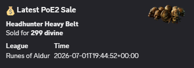

# PoE2Watch

> Never wonder if your trades sold again.

PoE2Watch is an open-source Discord companion for Path of Exile 2.

Receive Discord notifications when your items sell, track your personal trade history, and eventually monitor your league progression—all without constantly checking the trade website.

---

## Current Features

- ✅ Automatic sale notifications
- ✅ SQLite sale database
- ✅ Discord Bot
- ✅ Discord slash commands
- ✅ `/last5`
- ✅ Local-first architecture
- ✅ Duplicate sale detection
- ✅ Automatic migration from existing sales
- ✅ Rate limit handling
- ✅ Read-only trade history

---

## Current Status

**Version:** v0.3 Alpha

**Status:** Active Development

Current priorities:

- Trade analytics
- Multi-user architecture
- OAuth authentication *(pending guidance from Grinding Gear Games)*

---

## Roadmap

### v0.4

- [x] Sale watcher
- [x] SQLite storage
- [x] Discord Bot
- [x] `/last5`
- [ ] `/today`
- [ ] `/week`
- [ ] `/month`
- [ ] `/league`
- [ ] `/stats`

### v0.5

- [ ] User settings
- [ ] Notification thresholds
- [ ] Multiple Discord servers
- [ ] Summary reports

### v0.6

- [ ] OAuth authentication *(if supported by GGG)*
- [ ] Multi-user support
- [ ] Hosted backend
- [ ] PostgreSQL

### Future

- Wealth tracking
- League progression
- Goal tracking
- Web dashboard
- Stash analytics

---

## Setup

Copy:

`.env.example`

to

`.env`

and fill in your credentials.

---

## Philosophy

PoE2Watch is designed to be:

- Read-only
- Community driven
- Open source
- Respectful of Grinding Gear Games' policies
- Built by players, for players

---

## Website

https://poe2watch.app

---

## Disclaimer

PoE2Watch is an independent community project and is not affiliated with Grinding Gear Games.
