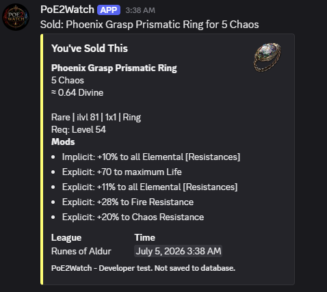
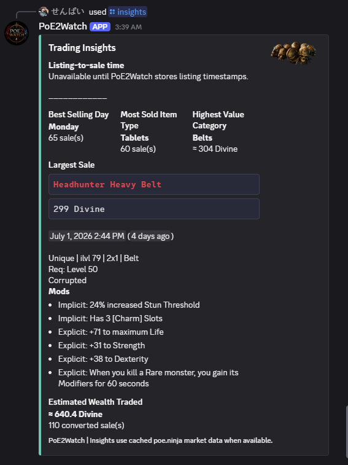
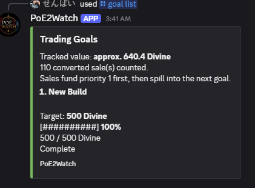
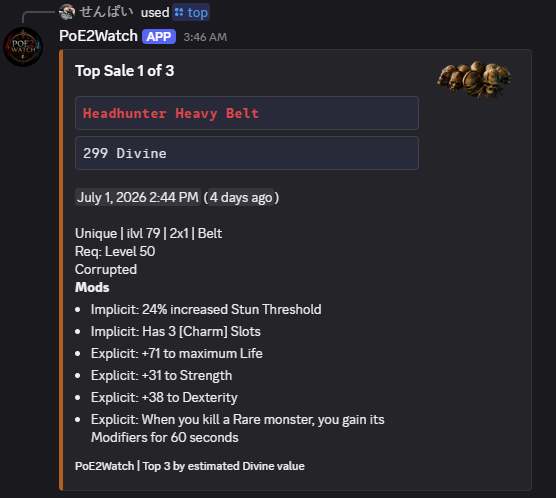

<p align="center">
  
</p>

<h1 align="center">PoE2Watch</h1>

<p align="center">
  <strong>Never wonder if your trade sold again.</strong>
</p>

<p align="center">
  A self-hosted Discord companion for Path of Exile 2 traders.
</p>

<p align="center">
  
  
  
  
</p>

<p align="center">
  <a href="https://poe2watch.app/">Website</a>
  |
  <a href="docs/installation.md">Setup</a>
  |
  <a href="docs/commands.md">Commands</a>
  |
  <a href="docs/security.md">Security</a>
  |
  <a href="CHANGELOG.md">Changelog</a>
</p>

---

## What Is PoE2Watch?

PoE2Watch watches your completed Path of Exile 2 sale history, sends Discord notifications when items sell, stores your trade history locally in SQLite, and turns those sales into useful stats, insights, goals, and setup health checks.

It is built for players who want to know when the trade tab finally did something useful.

Sometimes one trade is all it takes to get a build moving again. A good sale can mean the next upgrade, the next craft, or just a reason to log back in with a plan instead of staring at your stash.

Until official GGG OAuth support is confirmed, PoE2Watch stays local-first and self-hosted. Your session stays on your machine, and the app only watches your own completed sale history.

---

## Example Output

### Sale Notification

The example below was generated with `/dev fake-sale` so it does not save anything to the local sales database.

<p>
  
</p>

### Trading Insights

<p>
  
</p>

### Trading Goals

<p>
  
</p>

### Top Sales

<p>
  
</p>

---

## Highlights

| Feature | Status | What It Does |
| --- | --- | --- |
| Near-real-time sale notifications | Complete | Checks for sales every 7 minutes after recent activity and every 20 minutes when idle. |
| SQLite trade history | Complete | Stores sale history locally for summaries and analytics. |
| Adaptive polling | Complete | Checks faster after recent sales, slows down when idle, and respects rate-limit backoff. |
| Discord slash commands | Complete | Query stats, recent sales, insights, settings, goals, and top sales. |
| Hover-style item cards | Alpha | Preserves item payloads and shows rarity, item details, and modifiers. |
| Trading goals | Alpha | Track progress toward upgrades with prioritized goal spillover. |
| poe.ninja estimates | Alpha | Uses cached third-party market data for temporary value estimates. |
| Official GGG OAuth | Placeholder | Waiting on confirmed app registration and official guidance. |

---

## Quick Start

```bash
npm install
copy .env.example .env
npm run register
npm run dev
```

After setup, run this in Discord:

```text
/health
```

Full setup docs:

- [Installation](docs/installation.md)
- [Discord Bot Setup](docs/discord-setup.md)
- [Configuration](docs/configuration.md)

---

## Commands

| Category | Commands |
| --- | --- |
| Trading | `/last3`, `/today`, `/week`, `/month`, `/league`, `/top` |
| Goals | `/goal add`, `/goal list`, `/goal view`, `/goal complete`, `/goal remove`, `/goal reorder`, `/goal clear-all` |
| Analytics | `/stats`, `/insights` |
| Settings | `/settings view`, `/settings display`, `/settings refresh-rates` |
| Diagnostics | `/health` |
| Developer | `/dev fake-sale`, `/dev refresh-sale-metadata` |

Read the full command guide:

[docs/commands.md](docs/commands.md)

---

## Documentation

| Page | Purpose |
| --- | --- |
| [Overview](docs/overview.md) | Product vision, trust model, and project principles. |
| [Installation](docs/installation.md) | Local setup and first run. |
| [Discord Setup](docs/discord-setup.md) | Creating your own Discord app and webhook channels. |
| [Commands](docs/commands.md) | Every slash command and what it is for. |
| [Configuration](docs/configuration.md) | Environment variables and display settings. |
| [Security](docs/security.md) | Secret handling, Cloudflare checklist, and reporting issues. |
| [Roadmap](docs/roadmap.md) | Current alpha line and planned future work. |
| [Development](docs/development.md) | Local scripts, dev commands, and architecture direction. |

---

## Project Principles

PoE2Watch is designed to be:

- Read-only
- Self-hosted first
- Community driven
- Open source
- Respectful of Grinding Gear Games' policies
- Built by players, for players

PoE2Watch never automates gameplay, never controls the game client, and never performs trades.

---

## Disclaimer

PoE2Watch is an independent community project and is not affiliated with, endorsed by, or sponsored by Grinding Gear Games.
