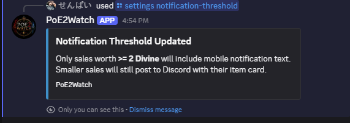

# Commands

PoE2Watch commands are grouped by purpose so each command has a clear job.

## Trading

| Command | Purpose |
| --- | --- |
| `/last3` | Show your three most recent sales as separate item-style embeds. |
| `/history search` | Search your local sale history by item name or type. |
| `/today` | Show today's sales summary. |
| `/week` | Show the last seven days of sales. |
| `/month` | Show the last thirty days of sales. |
| `/league` | Show full-league sales, league age, sales today, highest day, and average per day. |
| `/top` | Show up to three highest-value sales by estimated Divine value. |

### History Search

`/history search` searches your local SQLite sale history. It does not make a new Path of Exile trade request.

Useful examples:

```text
/history search query:ring
/history search query:headhunter
/history search query:belt currency:divine
/history search query:amulet days:7
```

It returns up to three matching sales as item-style embeds.

## Goals

| Command | Purpose |
| --- | --- |
| `/goal add` | Add a prioritized trading goal with a target amount and currency. |
| `/goal list` | View progress across all goals. Sales fund priority 1 first, then spill into later goals. |
| `/goal view` | View the current prioritized goal dashboard. |
| `/goal reorder` | Change which goal gets funded first. |
| `/goal complete` | Mark a goal achieved by priority number. |
| `/goal remove` | Remove a goal by priority number without marking it achieved. |
| `/goal clear-all` | Clear every trading goal. |

## Analytics

| Command | Purpose |
| --- | --- |
| `/stats` | Show all-time totals, averages, largest sale, and currency breakdowns. |
| `/insights` | Show best selling day, most sold item type, highest value category, largest sale, and estimated wealth traded. |

## Configuration

| Command | Purpose |
| --- | --- |
| `/settings view` | View current display and estimate settings. |
| `/settings display` | Choose original, Chaos, Exalted, Divine, or all display values. |
| `/settings notification-threshold` | Set the minimum estimated Divine value required for mobile notification text. Smaller sales still post to Discord. |
| `/settings refresh-rates` | Manually refresh cached third-party estimate rates. |

Example:



## Diagnostics

| Command | Purpose |
| --- | --- |
| `/health view` | Check local setup, database, exchange cache, goals, and watcher status without showing secrets. |
| `/health export` | Create a sanitized text report for GitHub Issues or setup support. |

## Developer Tools

| Command | Purpose |
| --- | --- |
| `/dev fake-sale` | Admin/dev-only test notification. Does not save fake sales. |
| `/dev refresh-sale-metadata` | Admin/dev-only backfill for item icons, rarity, and hover-style item details. |

## Trading Goals Example

```text
Trading Goal

1. Mageblood
Target: 500 Divine
[##########] 100%
500 / 500 Divine
Complete

2. Build Upgrade
Target: 120 Divine
[######----] 61%
74 / 120 Divine
46 Divine remaining

3. Crafting Fund
Target: 50 Divine
[----------] 0%
0 / 50 Divine
50 Divine remaining
```

Use `/goal complete priority:1` when a goal is achieved.

Use `/goal remove priority:1` when you want to delete a goal without marking it achieved.
