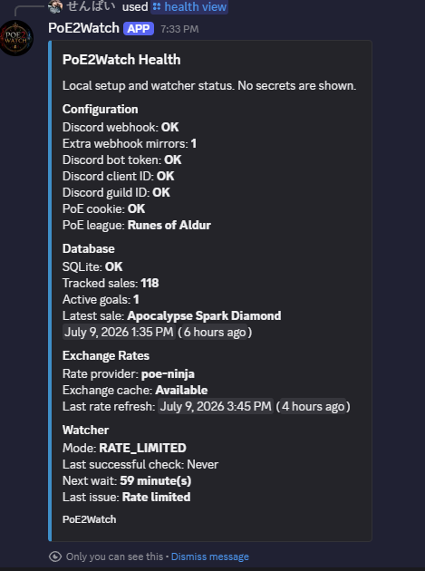
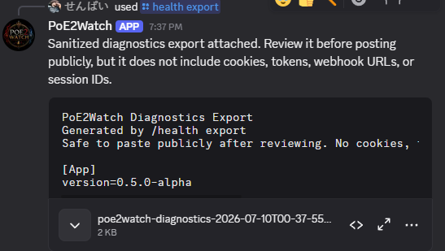

# Commands

PoE2Watch commands are grouped by job. The goal is that every command answers a different question instead of repeating the same information.

## Quick Command Table

| Command | What It Answers | Good For |
| --- | --- | --- |
| `/last3` | What sold most recently? | Checking the latest three sales as item cards. |
| `/top` | What are my biggest sales? | Seeing your top three sales by estimated Divine value. |
| `/history search` | Have I sold this kind of item before? | Searching local sale history by item name, type, currency, or date range. |
| `/today` | What did I sell today? | Daily trading check-in. |
| `/week` | What did I sell this week? | Short-term progress. |
| `/month` | What did I sell this month? | Longer progress check. |
| `/league` | How is the whole league going? | League dashboard, average per day, highest day, and sales today. |
| `/stats` | What are my all-time totals? | Totals, averages, largest sale, and currency breakdowns. |
| `/insights` | What patterns are in my sales? | Best day, most sold item type, highest value category, largest sale. |
| `/goal add` | What am I saving for? | Creating a Divine/Exalted/Chaos target. |
| `/goal list` | How close am I to my goals? | Progress bars and priority spillover. |
| `/settings view` | How is PoE2Watch configured? | Checking display currency, notification threshold, and rates. |
| `/settings notification-threshold` | Which sales should ping my phone? | Keeping small trades in Discord without mobile notification text. |
| `/health view` | Is my setup healthy? | Private status check without secrets. |
| `/health export` | What should I attach to a support issue? | Sanitized diagnostics report. |

## Trading Commands

| Command | Options | Purpose |
| --- | --- | --- |
| `/last3` | None | Shows your three most recent sales as separate item-style embeds. |
| `/top` | None | Shows up to three highest-value sales by estimated Divine value. |
| `/today` | None | Shows today's sales summary. |
| `/week` | None | Shows the last seven days of sales. |
| `/month` | None | Shows the last thirty days of sales. |
| `/league` | None | Shows full-league sales, league age, sales today, highest day, and average per day. |
| `/history search` | `query`, optional `limit`, `currency`, `days` | Searches your local SQLite sale history. |

### History Search Examples

```text
/history search query:ring
/history search query:headhunter
/history search query:belt currency:divine
/history search query:amulet days:7
/history search query:ring limit:1
```

`/history search` does not make a new Path of Exile trade request. It only searches sales already saved locally.

## Analytics Commands

| Command | Purpose |
| --- | --- |
| `/stats` | Shows all-time totals, average sale, largest sale, and totals grouped by currency. |
| `/insights` | Shows best selling day, most sold item type, highest value category, largest sale, and estimated wealth traded. |

## Goal Commands

Goals are priority based. Sales fund priority `1` first, then spill into priority `2`, then priority `3`, and so on.

| Command | Options | Purpose |
| --- | --- | --- |
| `/goal add` | `name`, `amount`, `currency`, optional `priority` | Adds a trading goal. |
| `/goal list` | None | Lists active goals with progress. |
| `/goal view` | None | Same dashboard view as `/goal list`. |
| `/goal reorder` | `priority`, `new-priority` | Moves a goal to a different priority. |
| `/goal complete` | `priority` | Marks a goal achieved and removes it from active goals. |
| `/goal remove` | `priority` | Removes a goal without marking it achieved. |
| `/goal clear-all` | None | Clears every active goal. |

### Goal Examples

```text
/goal add name:Mageblood amount:500 currency:Divine priority:1
/goal add name:Crafting Fund amount:50 currency:Divine
/goal reorder priority:2 new-priority:1
/goal complete priority:1
/goal remove priority:2
```

Use `/goal complete` when you actually achieved the goal. Use `/goal remove` when you just want it gone.

## Settings Commands

| Command | Options | Purpose |
| --- | --- | --- |
| `/settings view` | None | Shows current display and estimate settings. |
| `/settings display` | `currency` | Chooses original, Chaos, Exalted, Divine, or all display values. |
| `/settings notification-threshold` | `amount` | Sets the minimum estimated Divine value required for mobile notification text. |
| `/settings refresh-rates` | None | Manually refreshes cached third-party estimate rates. |

### Notification Threshold

Example:

```text
/settings notification-threshold amount:1
```

That means sales worth at least 1 estimated Divine include mobile notification text. Smaller sales still:

- post their item card to Discord
- save to the local database
- count toward stats, goals, history, and insights


## Diagnostics Commands

| Command | Purpose |
| --- | --- |
| `/health view` | Checks local setup, database, exchange cache, goals, and watcher status without showing secrets. |
| `/health export` | Creates a sanitized text report for GitHub Issues or setup support. |

Examples:





## Developer Commands

These are for testing and maintenance. They are limited to server administrators or users listed in `DISCORD_DEV_USER_IDS`.

| Command | Options | Purpose |
| --- | --- | --- |
| `/dev fake-sale` | optional `item`, `amount`, `currency`, `rarity` | Sends a real-style test sale notification without saving it. |
| `/dev refresh-sale-metadata` | None | Backfills item icons, rarity, and item details for recent known sales. |

`/dev fake-sale` is useful after setup because it proves Discord notifications are working without waiting for a real sale.
