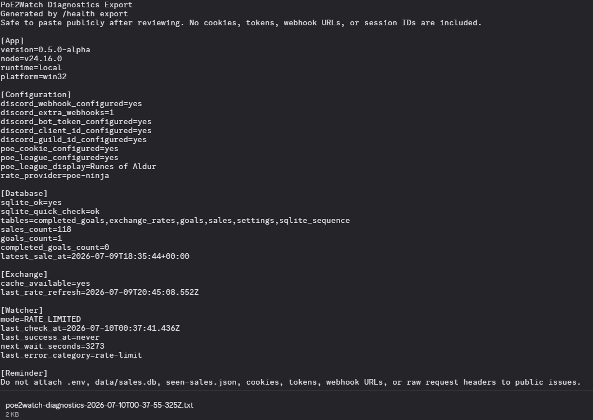

# Development

## Scripts

```bash
npm run dev
npm run start
npm run register
npm test
npm run typecheck
```

`npm test` uses Node's built-in test runner through `tsx`. The first tests cover value formatting, rarity handling, and item-card formatting.

## Docker Checks

The Docker runtime does not include npm/yarn, so use the direct Node command when registering commands inside the container:

```bash
docker compose build
docker compose run --rm poe2watch node node_modules/tsx/dist/cli.mjs src/registercommands.ts
docker compose up -d
docker compose logs -f
docker compose down
```

## Developer Commands

```text
/dev fake-sale
/dev refresh-sale-metadata
```

Fake sale notifications are clearly labeled and are not written to the sales database.

## Diagnostics

Use `/health view` for a private status embed.

Use `/health export` to create a sanitized `.txt` diagnostics report that can be attached to GitHub Issues. It reports setup state, database status, watcher status, and error categories without including cookies, tokens, webhook URLs, or session IDs.



PoE2Watch also prints a startup setup check in the terminal. It reports whether required config is present, whether SQLite is reachable, and reminds users how to register slash commands without printing secret values.

Run only one PoE2Watch process per Discord bot token. Do not keep Docker and `npm run dev` online at the same time, or both bot instances may try to answer the same slash command.

Optional allowlist:

```env
DISCORD_DEV_USER_IDS=your_discord_user_id
```

## Architecture Direction

As PoE2Watch grows, the next cleanup target is central configuration.

Planned structure:

```text
src/config/config.ts
```

The goal is to stop reading `process.env` directly throughout services and instead import a typed `config` object with sections for Discord, polling, exchange rates, OAuth placeholders, website links, and database settings.

The statistics layer will also split naturally as analytics grows:

```text
src/services/statistics/summary.ts
src/services/statistics/leaderboards.ts
src/services/statistics/insights.ts
src/services/statistics/charts.ts
src/services/statistics/formatter.ts
```

## Website

The static website lives in:

```text
website/index.html
```

It is designed to deploy directly from the `website` folder on Cloudflare Pages.

## Release Notes

See [CHANGELOG.md](../CHANGELOG.md) for release notes, including `v0.5.0-alpha`.
